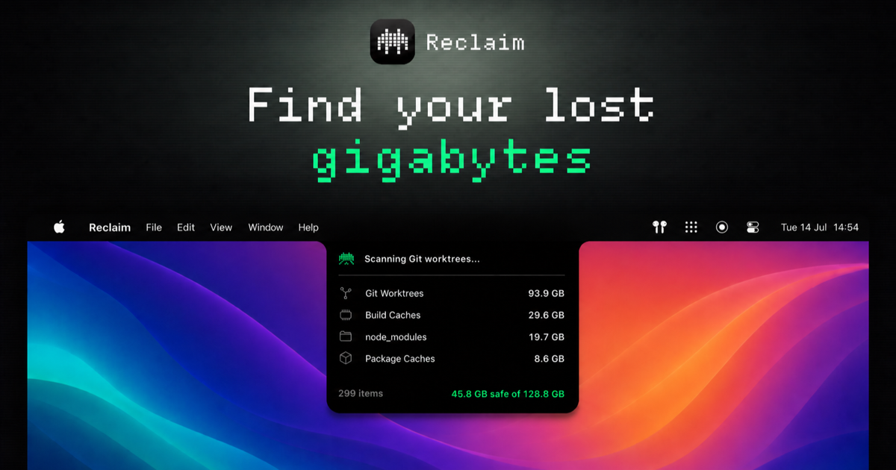

# Reclaim

Find your lost gigabytes — a macOS app that safely cleans the disk space eaten by git worktrees, build caches, and AI coding agents.

[](#install)
[](ReclaimKit)
[](LICENSE)
[](ReclaimKit/Tests)

[](docs/banner.png)

## Install

Build from source for now (Homebrew tap coming with the first release):

```sh
git clone https://github.com/0x00-sys/Reclaim.git
cd Reclaim
open Reclaim.xcodeproj
```

***

## Why Reclaim

- AI agents create a git worktree per task. A busy month leaves tens of gigabytes of abandoned repo copies in hidden folders.
- Every worktree gets a real git inspection: uncommitted changes, untracked files, commits that exist nowhere else, lock state, live sessions.
- Nothing is classified by file age alone, and nothing is deleted without your confirmation.
- Deletion is Trash-first and re-verified at the moment of removal — if work appeared since the scan, the item is refused.
- One-click clean of everything Safe, driven by your filters: category, tool, status, idle time.
- A notch panel shows live scan and cleanup progress, with pixel-art sprites per tool.
- 8-bit chime when it's done. Optional everything.

**Scans:** Codex · Claude Code · Conductor · Cursor · git worktrees · node_modules · `.next`/`.nuxt`/`.turbo`/cargo target · npm · pnpm · Bun · Go · Playwright · Homebrew · pip · Gradle · CocoaPods · Xcode

***

## Safety model

Every item gets a verdict with reasons: **Safe to clean**, **Review first**, **Active or protected**, or **Unknown**. The cleanup engine independently refuses anything dirty, unpushed, locked, in use by a running process, or holding open files — even if asked. The main worktree of a repository can never be removed. Force-cleaning refused items exists, but only behind a double confirmation, and it still can't touch the hard refusals.

Details and per-tool storage research with sources: [docs/RESEARCH.md](docs/RESEARCH.md)

***

## FAQ

**Where do deleted files go?**
The macOS Trash, always. Registered worktrees are additionally pruned from their repository so `git worktree list` stays truthful.

**Why isn't the app sandboxed?**
It scans development directories across your home folder, which the sandbox forbids. It is read-only except for the explicit, confirmed cleanup flow, and every git call uses argument arrays — never shell strings.

**Can I check what it would find without the app?**
Yes: `cd ReclaimKit && swift run reclaim-scan ~/dev --sizes` prints a read-only report.

**A tool I use isn't supported.**
Open an issue with where it stores data. If it can't be supported safely, Reclaim shows it as detected but unsupported rather than guessing.

***

## Under the hood

A thin SwiftUI app over `ReclaimKit`, a Swift package that owns scanning, classification, and cleanup. The engine is tested against fixture git repositories, including every refusal path and the race where a clean worktree becomes dirty between scan and delete.

```sh
cd ReclaimKit && swift test
```

## License

MIT
